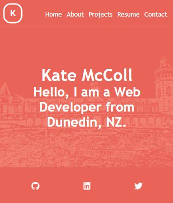

# React-Portfolio

## Description
I created this mobile-first portfolio using my new React skills, which will help set me apart from other developers whose portfolios don’t use the latest technologies.

### Live Link:
https://katemccoll.github.io/React-Portfolio/

## Table of Contents
- [User Story](#user-story)
- [Installation](#installation)
- [Usage](#usage)
- [Results](#results)
- [Contribution](#contribution)
- [License](#license)
- [Questions](#questions)

## User Story
AS AN employer looking for candidates with experience building single-page applications
I WANT to view a potential employee's deployed React portfolio of work samples
SO THAT I can assess whether they're a good candidate for an open position

## Installation
npm install

## Usage
npm build
npm start

## Results

## License
MIT License

Copyright (c) 2021 Kate McColl

## Contribution
Open to contributions

## Questions
If you have any questions, please contact me by Email: kate@katemccollart.com GitHub: [katemccoll](https://github.com/katemccoll)
